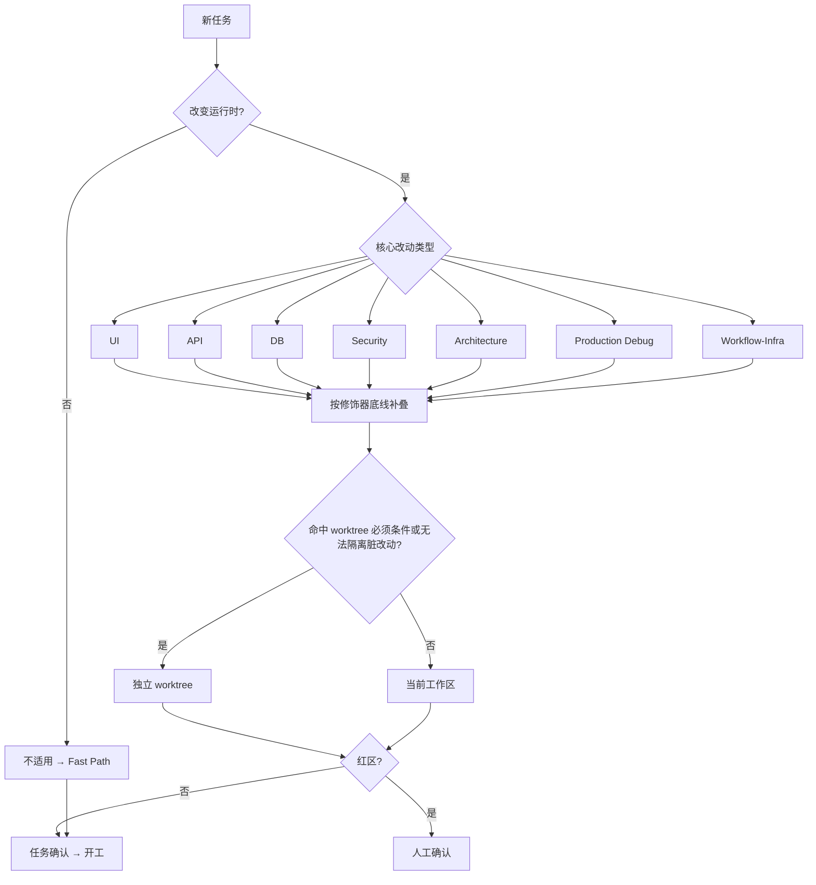

# DYNAMIC_WORKFLOW_RULES.md — 动态任务路由

本文件定义任务如何选主 Workflow、叠加强制修饰器，以及 Workflow Packet 字段语义。协作边界与 Memory 总规则见 `AGENTS.md`。

## 总规则

1. 先选**主 Workflow**，再按风险叠**修饰器**（全集如下，不得扩展）：
   - 主 Workflow：`UI` / `API` / `DB` / `Security` / `Architecture` / `Production Debug` / `Workflow-Infra` / 不适用
   - `Security`：权限、患者/报告信息、登录态、脱敏、审计
   - `DB`：后端迁移、种子、SQL、数据兼容、回滚（须引用后端验证）
   - `Red Team`：高风险、跨层、生产问题、权限/数据/报告
   - `Backend Cross-check`：须对照 `SYBaseProject` 实现或验证
   - `Browser 验证`：页面/组件/布局/样式/视口/浏览器兼容（低风险文案/非布局微调可按退出条件不叠）

2. **低风险退出**：文案/测试-only/注释-only 可不叠 Browser；Summary `Validation` 可承载轻量证据。绿区默认**不更新** memory、交付可省略 Memory 判定（见 `AGENTS.md` §8）。不得覆盖 Security/DB/红区/跨仓/生产问题。

3. **Packet 档位**（与 PR 模板一致）：
   - Fast Path：Workflow 不适用 + 验证；Memory 判定可选
   - Lightweight：主 Workflow + 触发信号 + 验证 + 剩余风险；Memory 判定仅 durable 变更时填写
   - Full：完整 Packet + Red Team 最低证据 + Memory 判定（有变更时）

4. **Loop Packet** 为显式 opt-in（见 `LOOP_ENGINEERING_RULES.md`）；未启用 loop 时不得要求填写。

5. 跨仓口径与后端 `SYBaseProject/docs/rules/DYNAMIC_WORKFLOW_RULES.md` 互为镜像；改分类/修饰器须同步评估另一仓。

## 触发信号速查表

| 改动路径 / 信号 | 主 Workflow | 必叠修饰器 |
| --- | --- | --- |
| 页面、组件、布局、样式、视口 | UI | Browser（低风险退出见总规则） |
| api、mapper、mock、联调 | API | Backend Cross-check（跨仓时） |
| 后端 migration/SQL/种子/回滚 | DB | DB + Backend Cross-check + Red Team |
| 权限、登录态、患者/报告、导出、审计 | Security | Security + Red Team |
| 重构、共享层、循环依赖、构建工具链 | Architecture | Red Team（跨层时） |
| 生产问题、性能回退、`.logs/` 已有错误 | Production Debug | Red Team + Backend Cross-check（跨仓时） |
| hooks、CI、脚本、环境变量、发布路径 | Workflow-Infra | Red Team（红区时） |
| 纯文档、不改运行时 | 不适用 | 无 |

修饰器叠加底线：权限/患者/报告 → Security；后端 DB → DB；高风险/跨层/生产 → Red Team；跨仓 → Backend Cross-check；UI 布局/视口 → Browser（可退出）。

## 决策流程图

## Workflow Packet

**完整 Workflow Packet** 字段：

- 主 Workflow
- 触发信号
- 专家 Agent
- 动态测试 / 动态模拟
- 动态安全 / 动态数据库（若触发修饰器）
- Red Team
- Memory Update

**轻量 Workflow Packet** 字段：

- 主 Workflow
- 触发信号
- 动态测试（或 Summary Validation 已写清则省略）
- Memory Update（**仅 durable 变更时**）
- 剩余风险 / 未验证项

高风险最低证据：Red Team 须含攻击路径、预期失败点、实际结果、剩余风险；启用 Checker 须说明来源与结论。

## 各 Workflow 要点

Memory 是否更新以 `AGENTS.md` §8 为准；下表的 Memory 列只列常见示例，不新增触发条件。

| Workflow | 典型验证 | Red Team 重点 | Memory 示例 |
| --- | --- | --- | --- |
| **UI** | 相关单测/E2E；共享组件补 `check:type` | 权限绕过、按钮不可达、敏感数据进弹窗/URL/导出 | PROJECT_STATE；UI 债务/bug → TECH_DEBT/KNOWN_BUGS；共享组件边界 → DECISIONS/ARCHITECTURE |
| **API** | service/mapper 单测；跨仓引用后端 verify | DTO 直透视图、吞错误、字段错配 | 契约结论 → DECISIONS；联调缺陷 → TECH_DEBT/KNOWN_BUGS |
| **DB** | 前端只验展示兼容；DB 证据引用后端 MR | 丢数据、隐藏兼容缺口、缺回滚 | TECH_DEBT/KNOWN_BUGS/DECISIONS/ARCHITECTURE + 跨仓引用 |
| **Security** | 权限/路由单测；`auth-router-request` E2E | 直达 URL/接口越权、敏感数据泄露 | KNOWN_BUGS/DECISIONS/ARCHITECTURE |
| **Architecture** | `lint` + `check:type` + `check:circular` + 单测 | 浅封装、跨层依赖、删测试/降级 | ARCHITECTURE/DECISIONS/TECH_DEBT |
| **Production Debug** | 先读 `.logs/` 复现再修；补回归测试 | 未复现就修、缺回滚/回归 | PROJECT_STATE/KNOWN_BUGS/DECISIONS |
| **Workflow-Infra** | hook/CI 命令；必要时 `build:ele` | 绕过 hook、改写非目标文件、本地路径入库 | PROJECT_STATE/DECISIONS/ARCHITECTURE/KNOWN_BUGS |

专家 Agent 可由人工、子 Agent 或 skill 承担；映射见 `AGENT_SKILL_ROUTING.md`。

## 关联文档

- [../../AGENTS.md](../../AGENTS.md)
- [./QUICKSTART.md](./QUICKSTART.md)
- [./LOOP_ENGINEERING_RULES.md](./LOOP_ENGINEERING_RULES.md)
- [./GIT_RULES.md](./GIT_RULES.md)
- [../templates/workflow-packet-examples.md](../templates/workflow-packet-examples.md)
